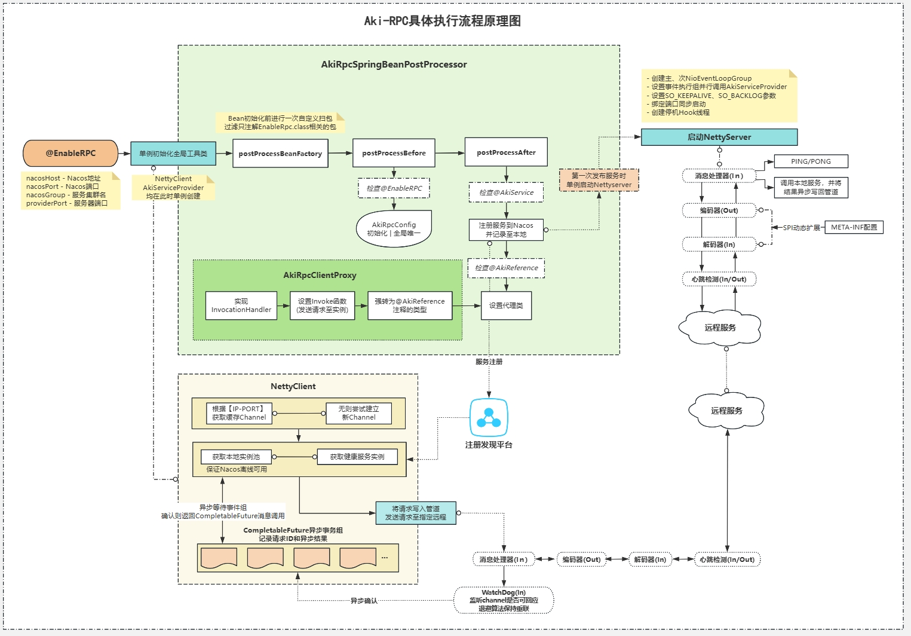
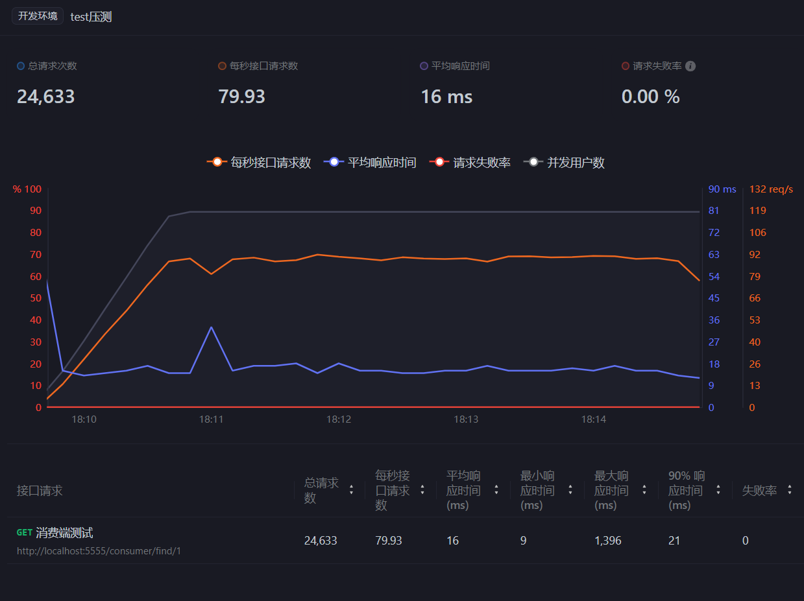
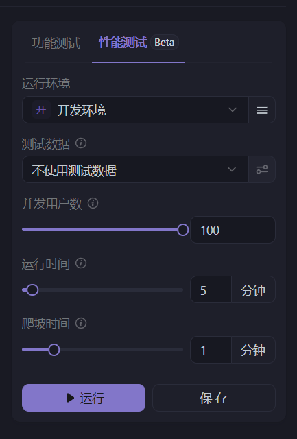

# Aki-RPC
一款基于TCP传输模式的高性能可拓展的 RPC 框架，旨在实现低侵入、无感调用的开源远程服务框架。

## 详细说明


## 已完成
- 实现对连接的心跳监测和退避重连
- 实现异步通讯架构大幅提升网络性能
- 实现自定义的高性能通信协议，解决粘包、拆包问题
- 池化处理Channel和远程实例，优化缓存压力
- 实现了SPI动态插件式加载压缩算法和序列化算法
- 支持服务注册发现，并在注册发现平台离线后仍可依赖本地缓存连接
- 无需大盖原有逻辑，仅两、三个注解即可完成服务发布和远程调用


## 项目模块
- **aki-rpc**
- - **annotation:** 注解包，定义了@AkiReference、@AkiService以及@EnableRpc注解;
- - **config:** 全局配置包;
- - **constant:** 全局常量与枚举包;
- - **exception:** 全局错误处理包;
- - **factory:** 单例工厂工具包;
- - **message:** 消息传输DTO;
- - **register.nacos:** 服务发现注册的工具包，以及已经实现完成的Nacos注册工具类;
- - **compress:** 压缩类接口及其实现的工具类;
- - **serialize:** 序列化类接口及其实现的工具类;
- - **server:** 实现netty server与client端
- - **proxy:** 对指定bean设置动态代理的工具类;
- - **spring:** 用于对标注@EnableRpc的主类项目扫包，发布服务并执行动态代理;
- - **utils:** 包装运行期获取CPU核心数的工具类;
- - **META-INF:** 用于提供给SPI机制所需的服务配置文件。

## 传输帧结构
```
  0     1     2     3     4        5     6   7    8      9            10      11       12    13    14  15  16
  +-----+-----+-----+-----+--------+----+----+----+------+------------+-------+--------+-----+-----+---+----+
  |     magic_code        |version |     full_length     | messageType| codec |compress|    RequestId       |
  +-----------------------+--------+---------------------+------------+-------+--------+--------------------+
  |                                                                                                         |
  |                                                   body                                                  |
  |                                                                                                         |
  |                                                  ... ...                                                |
  +---------------------------------------------------------------------------------------------------------+
```

| 字段            | 释义                                                                                          | 大小 |
| :-------------- |:--------------------------------------------------------------------------------------------|----|
| magic_code    | 魔法数。表识一个有效Aki-RPC通讯协议包，默认为```'k' ``` ```'i' ``` ```'r'```  ```'a'```四个字节。                   | 4B |
| version   | 版本号。协议版本号当前版本号为 ```1```。该字段可以用于区分不同版本的协议，便于后续扩展和兼容性处理。                                      | 1B |
| full_length   | 消息头部的固定长度。确保解析时可以确定消息体的位置                                                                   | 4B |
|  messageType  | 消息类型。```0x01```请求消息类型; ```0x02```响应消息类型; ```0x03```心跳检测请求消息类型; ```0x04```心跳检测响应消息类型; 后续可拓展。 | 1B |
| codec    | 序列化类型。 ```0x01```ProtoStuff序列化类型。 可通过SPI执行扩展。                                               | 1B |
|compress    | 消息压缩类型。 ```0x01```GZip压缩类型。 可通过SPI执行扩展。                                                     | 1B |
| RequestId   | 请求的Id。为```AtomicInteger ATOMIC_INTEGER```全局自增实现。可拓展为其他ID生成算法。                               | 4B |
|  body      | 数据消息。通常为被序列化、再经压缩后的```AkiRequest``` ```AkiResponse``` ```HEART_PING``` ```HEART_PONG``` 对象。 | -  |

## 性能测试
ApiFox测试
<div style="display: flex; justify-content: space-between;">
   
</div>


## 使用流程
### 1.Nacos
**请先确保一台暴露有效端口的Nacos服务**
[点击此处进入官方部署手册。](https://www.nacos.io/docs/v2.3/quickstart/quick-start/)

### 2.启用RPC服务

```java
// 生产端
// 在生产端主类上方启用@EnableRpc并填入相关配置信息
@EnableRpc(
//        nacosHost = "",   //nacos服务地址，选填，默认为localhost
//        nacosPort = 0,    //nacos服务端口，选填，默认为8848
//        nacosGroup = "",  //服务注册的群组名，选填，默认为"aki-rpc"
//        serverPort = 0    //生产端部署服务的总端口，选填，默认为本机随机未占领端口
)
@SpringBootApplication
public class ProviderApp {
    public static void main(String[] args) {
        SpringApplication.run(ProviderApp.class,args);
    }
}
```

```java
// 消费端
// 在消费端主类上方启用@EnableRpc并填入对应的配置信息
@EnableRpc(nacosGroup = "aki-rpc")      
@SpringBootApplication
public class ConsumerApp {
    public static void main(String[] args) {
        SpringApplication.run(ConsumerApp.class,args);
    }
}

```

### 3.在生产端发布一项服务

```java
// 在实现的业务函数上启用@AkiService并标注方法版本
@AkiService(
        version = "1.0"     // 选填，默认为"1.0"
)
@Service
public class ProviderTestServiceImpl implements ProviderTestService {
    public TestResult TestFunction(TestRequest testRequest) {
        return new TestResult("Hello, World!");
    }
}

```

### 4.在消费端调用一项服务
```java
@RestController
@RequestMapping("test")
public class ConsumerController {
    
    //对需要的工具类启用 @AkiReference注解
    //此处会根据类型自动远程装配对应实例
    @AkiReference(
            version = "1.0"      // 选填，默认为"1.0"
    )
    private ProviderTestService providerTestService;
    
    @GetMapping("/{var}")
    public TestResult find(@PathVariable TestRequest var){
        return providerTestService.TestFunction(id);
    }
}
```


## 许可证
Aki-RPC在 MIT 许可下可用。查看[LICENSE](pic/LICENSE.txt) 文件了解更多信息。
